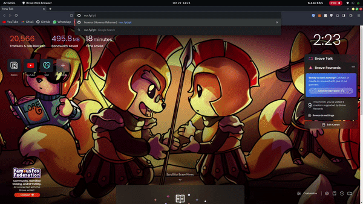

# EDGY

Redirects on the edge using Cloudflare Workers and Upstash Redis. 


 
## Run Locally

Clone the project

```bash
  git clone https://github.com/hosenur/edgy
```

Go to the project directory

```bash
  cd edgy
```

Install dependencies

```bash
  yarn install
```

Deploy to Cloudflare

```bash
  yarn deploy
```

Set Redirects in the Upstash Dashboard
```bash
SET git https://github.com/hosenur
```


## Environment Variables

To run this project, you will need set your Upstash Redis credentials after deplying your project using the Wrangler CLI. Headover to the Upstash Dashboard to get your credentials.
```
wrangler secret put <KEY>
```

`UPSTASH_REDIS_REST_URL`

`UPSTASH_REDIS_REST_TOKEN`

